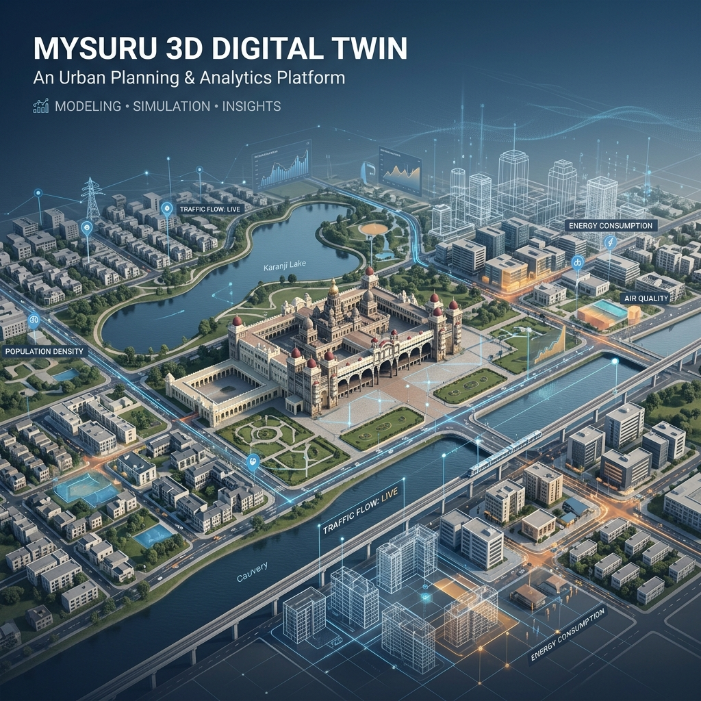

# 🏙️ Nexus Twin: 3D Digital Twin Command Center v6.0



## 📡 PROJECT OVERVIEW
**Nexus Twin** is a professional-grade urban simulation and spatial governance platform. Designed as a high-fidelity "Cyber-SOC" interface for Mysuru, it synthesizes real-world geospatial data, 3D architectural footprints, and critical utility infrastructure into a unified digital twin.

Built for urban planners and policy makers, the platform leverages **Supabase + PostGIS** for managed spatial storage and **Next.js 16** for high-performance city-wide visualization.

---

## 🏗️ System Architecture
The project follows a **Domain-Driven Modular** structure, separating the platform into specialized portals while maintaining a unified core.

| Component | Technology | Role |
| :--- | :--- | :--- |
| **Core Rendering** | **MapLibre + Deck.gl** | WebGL-accelerated 3D urban rendering and spatial layers. |
| **Database** | **Supabase / PostGIS** | Managed cloud storage for city assets and geospatial analysis. |
| **Frontend** | **Next.js 16 (Turbopack)** | High-performance dashboard lifecycle and routing. |
| **Simulation** | **Custom ABM Engine** | Agent-Based Modeling for real-time traffic and citizen behavior. |
| **AI Advisor** | **Ollama (Gemma)** | Professional urban policy auditing and strategic reporting. |

---

## 🚀 Advanced Command Features (v6.0)

### **1. 🗺️ CITY-WIDE UNDERGROUND X-RAY**
- **Unified Infrastructure Mapping**: High-density visualization of over **6,000+ utility features** across the entire Mysuru map.
- **Color-Coded Vitale**: Real-time tracking of the Power Grid (White), Water Mains (Blue), Gas Pipelines (Orange), and Sewage Systems (Yellow).
- **Ground-Locked Precision**: Native MapLibre rendering ensures infrastructure is pinned to the city floor without perspective drift.

### **2. 🏗️ URBAN SANDBOX & REPURPOSING**
- **One-Click Transformation**: Select any building on the map and immediately "reply" by repurposing it into Education Centers, Healthcare Hubs, or Smart Towers.
- **Multi-Selection Engine**: Advanced **Shift-Click** support for batch-managing urban assets and executing large-scale demolitions or upgrades.
- **Impact Projections**: Instant holographic reports showing economic (Prosperity) and social (Happiness) shifts for every structural change.

### **3. 🤖 STRATEGIC DIRECTIVES & AI**
- **Nexus AI Advisor**: Professional urban policy auditing with dynamic viability scoring and PDF report generation.
- **Fiscal Transparency**: Precise budget management with multi-unit support (Lakh / Crore) and automated ROI calculation.
- **Global Broadcast**: Real-time deployment of city-wide governance alerts across the citizen notification network.

### **4. 🚨 CRISIS & SIMULATION**
- **3D Flood Modeling**: Dynamic monsoon inundation tracking with real-time risk scoring and adaptive agent pathfinding.
- **Agent Physics**: Real-time traffic and pedestrian modeling that responds to atmospheric conditions (Rain, Smog).

---

## 🏛️ DATA PERSISTENCE
The platform is powered by a robust **Supabase + PostGIS** backend. 
See [SUPABASE_SCHEMA.md](./SUPABASE_SCHEMA.md) for the full SQL initialization scripts covering:
*   3D Building Footprints & Status Tracking
*   Persistent Custom Asset Placements
*   City-Wide Sentiment Mapping
*   Strategic Policy Logs

---

## ⚙️ INSTALLATION & RUNNING

### Prerequisites
*   Node.js (v18+)
*   Ollama (with `gemma` model downloaded)

### 1. Project Initialization
```bash
# Install all dependencies (Client & Server)
npm run install:all
```

### 2. Launch Development Environment
```bash
# Start both Server (3001) and Client (9000)
npm run dev
```
*   **🏙️ Admin Nexus**: [http://localhost:9000/admin](http://localhost:9000/admin)
*   **📡 Analysis Service**: [http://localhost:3001/api](http://localhost:3001/api)

---

## 👤 AUTHOR
**Bharath Kumara**
*   *Digital Twin Architect & Geospatial Engineer*

---

> *"The future of urban governance is not in papers, but in pixels."* - **Nexus Twin CMD v6.0**
