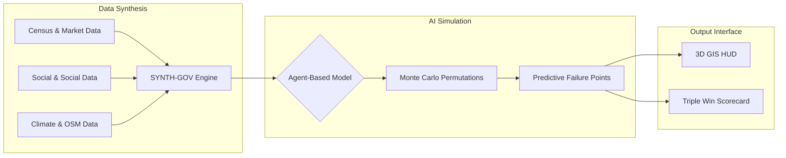

# Mysuru 3D Digital Twin
### Next-Gen Policy Impact Simulation Engine (P.I.S.E.)

  
  
  
  

---

## 🏙️ THE VISION: BEYOND PIXELS TO PEOPLE
**Mysuru 3D Digital Twin** is no longer just a static map. It has evolved into an **Agent-Based Digital Twin of Society**, powered by the **SYNTH-GOV** engine. We move beyond linear urban planning to simulate the complex ripple effects of every policy decision on the 1.3 million citizens of Mysore.

> *"Identify 'Black Swan' events before they happen. Governance powered by pixel-perfect simulation."*

---

## 🛡️ THE P.I.S.E. FRAMEWORK
We bridge the gap between policy input and real-world impact through a four-stage synthetic environment.

### 1. The Problem: Linear Policy Failure
Current urban governance often suffers from:
- **Static Models**: Failing to account for dynamic human movement.
- **Isolated Thinking**: Missing the connection between a new road and local small-business stress.
- **Unintended Consequences**: Social backlash or economic drops caused by blind-spot planning.

### 2. The Solution: Synthetic Environment
Our **Agent-Based Modeling (ABM)** simulates:
- **Individual Citizen Behavior**: Modelling how residents react to changes in real-time.
- **1 Million "What-If" Scenarios**: Running high-speed permutations in a **Policy Sandbox** to find the optimal path forward.

### 3. How It Works: The Engine
By synthesizing multi-sector data, we create a high-fidelity simulation:
| Inputs | AI Analysis Engine | Outputs |
| :--- | :--- | :--- |
| 📊 **Census Data** | Monte Carlo Simulations | 📡 **Risk Radar** |
| 📱 **Social Trends** | Predictive Failure Points | 📈 **Cross-Sectoral Impact** |
| 💹 **Market Flux** | Feedback Loop Analysis | ⚠️ **Black Swan Detection** |
| ☁️ **Climate Logs** | Heuristic Urban Mapping | 🏁 **Optimal Policy Paths** |

### 4. Impact: The Triple Win Dashboard
Every decision is graded against a professional **Scorecard**:
- 💰 **Fiscal Responsibility**: Quantifying averted wasted billions through optimized resource allocation.
- 👥 **Social Equity**: Ensuring balanced growth across all wards and demographics.
- 🤝 **Public Trust**: Increasing citizen confidence through evidence-based, transparent governance.

---

## 🛠️ INTEGRATED COMMAND HUD

### 🏗️ URBAN ADMIN MISSIONS
*   **Simulated Demolition**: Execute a "What-If" to see instant impact on traffic and household utility access.
*   **Street View Portal**: Teleport to ground-level for any structure to verify structural integrity.

### 🌊 CRISIS SIMULATOR
*   **Flood Pulse Analysis**: A 0-15m inundation slider with real-time building vulnerability color-coding.
*   **Emergency Vascular Map**: Optimal routing for Fire and EMS based on dynamic road blockage.

### 🌿 ECO-TRACE & HERITAGE
*   **AQI & VHI Heatmaps**: Monitor air quality and vegetation health across the historic landscape.
*   **Temporal Voyager**: A 1920-2024 slider to visualize urban sprawl and protect landmark dossiers.

---

## 💻 TECHNICAL ARCHITECTURE

---

## ⚙️ DEPLOYMENT
1.  **Initialize**: `npm install && cd client && npm install`
2.  **Launch Interface**: `npm run dev`
3.  **Access Hub**: `http://localhost:5173`

---

## 👤 PROJECT STEWARD
**Bharath Kumara**  
*Lead Architect | Digital Twin & GIS Engineer*

---
*A contribution to the **Digital India / Smart Cities Mission**. For sustainable, evidence-based urban evolution.*
