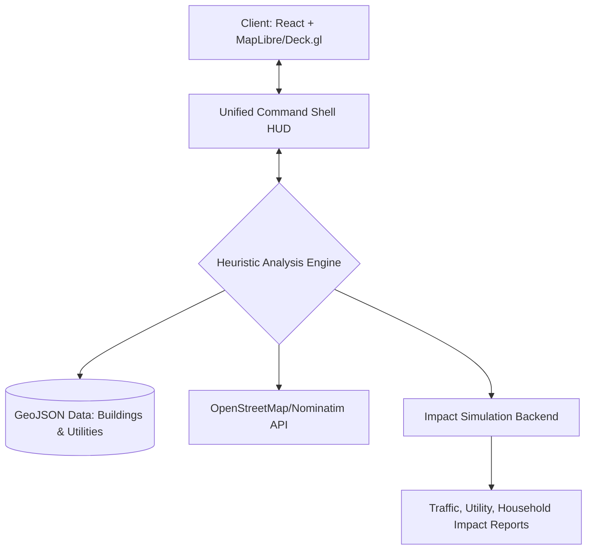

# 🏛️ Mysuru 3D Digital Twin: Integrated Command Shell v3.0


[](https://github.com/bharathkumar000/smart-city-clone)
[](https://github.com/bharathkumar000/smart-city-clone)
[](https://github.com/bharathkumar000/smart-city-clone)
[](https://github.com/bharathkumar000/smart-city-clone)

> *"The future of urban governance is not in papers, but in pixels."* — **Global Urban Planning Initiative**

**Mysuru 3D Digital Twin** is a high-fidelity, interactive urban planning and management platform designed for the **Heritage City of Mysuru**. This integrated command center synthesizes real-world geospatial data, 3D building architectural footprints, and critical utility infrastructure into a single, immersive glassmorphic interface.

---

## 📡 SYSTEM ARCHITECTURE

Our unified command-shell architecture ensures seamless synchronization between the 3D GIS viewport and the analytical backend engine.



---

## 🛠️ CORE MODULES (The 5-Tab Command Center)

### ⚡ 1. ADMIN MISSIONS (Urban Management)
*   **🏗️ Demolish Analysis**: A revolutionary "What-If" planning tool. Execute a simulated demolition to instantly generate a **Live Impact Report**, calculating affected households, traffic lag, and utility service disruptions.
*   **📸 Street View Integration**: Instant teleportation to ground-level Google Street View for any selected 3D structure.
*   **📍 Spatial HUD**: Real-time metadata display for building heights, structural types, and historical relevance.

### 🌊 2. CRISIS SIMULATOR (Emergency Response)
*   **🌊 Dynamic Flood Overlays**: Simulate rainfall scenarios with a 0-15m inundation slider. Watch as the city color-codes buildings based on critical depth levels.
*   **🚒 Fire Hydrant Network**: Instant visualization of fire hydrants across the urban fabric for rapid firefighting deployment.
*   **🚑 EMS Optimal Routing**: Plot and visualize emergency vehicle paths during crisis states with dynamic road network analysis.

### 🌿 3. ECO-TRACE (Environmental Health)
*   **🌫️ AQI Heatmapping**: Real-time heatmap visualization of the Air Quality Index (AQI) across different sectors.
*   **🍃 Green Index (VHI)**: Toggle the Vegetation Health Index layer to monitor the city's green cover and sustainability scores.
*   **📊 Sustainability Score**: Automated city-wide health scoring based on green index and pollution data.

### ⏳ 4. HERITAGE TIMELINE (Historical Evolution)
*   **📜 Temporal Slider (1920 - 2024)**: Travel through time. Visualize the city sprawl with custom sepia-filtered historical map overlays.
*   **🏰 Landmark Dossier**: Deep-dive into heritage sites like the **Amba Vilas Palace** with embedded architectural documentation and galleries.

### 💬 5. SOCIAL RADAR (Citizen Engagement)
*   **📝 Citizen HUD**: A map-integrated reporting system for public infrastructure issues (streetlights, potholes, etc.).
*   **📍 Spatial Verification**: Users can pin reports directly to the 3D map for precise location verification by city officials.

---

## 🕵️ VISION LAYERS & NAVIGATION

*   **🦴 X-Ray Mode (Underground)**: Peel back the city's surface to reveal the "Vascular System"—Electricity lines (Orange), Water pipes (Blue), and Gas mains (Red).
*   **🛰️ Multi-Spectral Styles**: Toggle between High-Res Satellite imagery and clean Vector Street maps.
*   **🛸 Fly-To Search**: A global search engine powered by OSM for instant landmark navigation.

---

## 💻 TECHNICAL STACK

| Layer | Technologies |
| :--- | :--- |
| **Frontend** | React.js, Vite, Framer Motion |
| **Mapping** | MapLibre GL, Deck.gl, GeoJSON |
| **Analysis** | Integrated Local Heuristic Engine |
| **Styling** | Vanilla CSS (Glassmorphism), Lucide Icons |
| **Geospatial** | OSM Nominatim API, Map Styles (Google/Maptiler) |

---

## ⚙️ INSTALLATION & DEPLOYMENT

### Prerequisites
- Node.js (v18+)
- npm / yarn

### 1. Project Initialization
```bash
npm install
cd client && npm install
```

### 2. Launch Universal Interface
```bash
npm run dev
```
- **🌐 Dashboard**: [http://localhost:5173](http://localhost:5173)

---

## 📂 PROJECT TAXONOMY

```bash
├── client/          # Vite + React 3D Interface
│   ├── src/        # HUD Components & Integrated Logic
│   └── public/     # Static GIS Assets (Buildings, Utilities)
├── data/            # Local GeoJSON datasets (Mysuru City Data)
└── assets/          # Digital Identity, Banners & Icons
```

---

## 👤 AUTHOR & LEAD ENGINEER

**Bharath Kumara**  
*Lead GIS Engineer & Digital Twin Architect*  

---

> This project is a contribution to the **Digital India / Smart Cities Mission**. For collaborators: please follow the standard PR workflow and ensure all 3D layers are optimized for WebGL.
